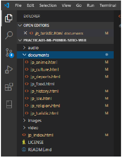

# Practica01-Mi-Primer-Sitio-Web

Creacion de Una pagina Web con Informacion de Japon, 
la pagina Web cuenta con imagenes, audios, videos propios y una instancia 
de videos de youtube.

<h1>Objective</h1>

<ul>
  <li>Create the structure of an HTML document</li>
  <li>Insert HTML elements and attributes </li>
  <li>Mark content using lists create a navigation list</li>
  <li>link to files within a website with hypertext links</li>
</ul>

<h1>INFORME DE LA PRACTICA</h1>
<ul>
	<li>Una página principal denominada index.html</li>
	<li>Ocho páginas en formato *.html secundarias con temas relacionados a la página principal. Nota.- las páginas html, imágenes, audios, videos y otros recursos deberán estar organizadas en carpetas.</li>
</ul>

<ul>
	<li>Todas las páginas deberán tener un menú de navegación el cuál, permite al usuario navegar de una manera clara y sencilla entre todas las páginas HTML, tanto la principal como la secundaria.</li>
	<li>Todas las páginas *.html deben estar estructuradas según la semántica de HTML5. Nota.- se debe explicar la estructura de cada una de las página. Una estructura correcta de HTML5, sería:</li>
    &nbsp;&nbsp; &#8226; <b>header</b> Etiqueta de encabezado, en la cual se inserta el logo de la página.  
    &nbsp;&nbsp; &#8226; <b>nav</b> Etiqueta para navegar a través de la página.  
    &nbsp;&nbsp; &#8226; <b>section</b> Etiqueta para definir una sección.  
    &nbsp;&nbsp; &#8226; <b>article</b> Etiqueta para definir un artículo.  
    &nbsp;&nbsp; &#8226; <b>aside</b> Etiqueta generalmente usada para Publicidad.  
    &nbsp;&nbsp; &#8226; <b>footer</b> Etiqueta usada para el pie de página, aquí se puso la información del desarrollador.
	<li>Todas las páginas *.html deben tener una etiqueta <b>header</b> la cuál, deberá contener una imagen (logo) relacionada al tema elegido.</li>
</ul>

  
<ul>
    <li>Todas las páginas *.html deben tener una etiqueta <b>footer</b> la cuál, deberá tener la información del estudiante como nombres completos, organización, correo (usar hipervínculo, mailto), teléfono (usar hipervínculo, tel), además deberá tener el símbolo de copyright junto a la leyenda de “Todos los derechos reservados”. Por ejemplo, © Todos los derechos reservados</li>
	<li>Las páginas *.html deberán tener al menos dos etiquetas <b>section</b>, <b>article</b> y <b>aside</b>.</li>
</ul>
  
   
<ul>
    <li>De igual manera, se pide que al menos una de las páginas dentro del contenido de la etiqueta , tengan los siguientes requisitos:</li>
	<ol>
        <li>Una tabla con la siguiente estructura:</li>
        <li>Un video de YouTube (ver, etiqueta <b>iframe</b> ).</li>
        <li>	Un video con la etiqueta <b>video</b>.</li>
        <li>	Un audio con la etiqueta <b>audio</b>.</li>
        <li>	Manejar listas ordenadas o desordenadas con al menos cinco ítems.</li>
        <li>	Tener al menos cinco etiquetas de texto que se encuentran en la figura 1- 16 del texto guía de la asignatura.</li>
    </ol>
</ul>
 
 
<ul>	
    <li>Asimismo, se pide que todos los artículos tengan al menos una imagen cada uno. Nota.- se pide que todas las imágenes están almacenadas en una carpeta llamada “images”. Por lo tanto, se debe trabajar con rutas relativas.</li>
</ul>
 

<ul>
    <li>Finalmente, se pide que una de las páginas tenga al menos cuatro secciones () con tres artículos () cada sección. Luego, cada sección debe tener un encabezado (), en donde, se ubicaran enlaces que permitan navegar entre los artículos usando id’s (ver, página 63 del texto guía).</li>
</ul>
 
 
<ul>
    <li>La evidencia de la validación de cada página HTML.</li>
</ul>
  

URL del repositorio de la práctica  
https://github.com/fcordovaa/Practica01-Mi-Primer-Sitio-Web  
URL del repositorio del Tutorial 01 - Curbside Thai 
https://github.com/fcordovaa/Curbside-Thai

<h1>Conclusiones</h1>

En el respectivo trabajo se llego a comprender de mejor manera la estructura básica de un archivo HTML de tal manera que sea mucho mas ordenada y a la hora de visualizar sea más rápido encontrar tales etiquetas, de igual manera se comprendió el uso de las etiquetas <b>iframe</b>, <b>video</b> y <b>audio</b>, también se logro comprender el uso de tablas, el uso de títulos y su respectiva jerarquía. En esta practica no se uso CSS por lo cual solo se tiene el fondo blanco por defecto y color negro en el texto, pero en las imágenes si se le añadió un formato de tamaño para que sea mas visible a la hora de visualizar la página.

<h1>Firma</h1>

